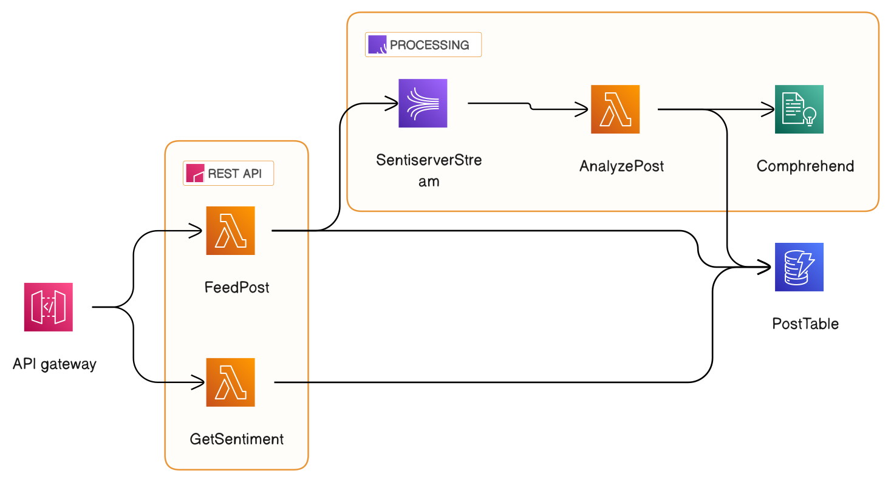

# Sentiserver

Sentinel - Real-time Sentiment Analysis for Social Media Posts using AWS Serverless Stack

This project is for analyzing post(or any text) using AWS Comprehend.

## Architecture



## Usage

### Endpoints

#### POST /feed

This endpoint is for analyzing post(or any text) using AWS Comprehend.

Body:

```json
{
  "text": "This is a sample text"
}
```

Response:

```json
{
  "status": "pending",
  "timestamp": "2021-01-01T00:00:00.000Z",
  "updated_at": "2021-01-01T00:00:00.000Z",
  "sentiment": "NEUTRAL",
  "sentimentScore": {
    "positive": 0.0,
    "negative": 0.0,
    "neutral": 1.0,
    "mixed": 0.0
  }
}
```

#### GET /sentiment?id={id}

This endpoint is for getting the result of the analysis. You might need to wait for a while until the analysis is done.

Response:

```json
{
  "status": "done",
  "timestamp": "2021-01-01T00:00:00.000Z",
  "updated_at": "2021-01-01T00:00:00.000Z",
  "sentiment": "NEUTRAL",
  "sentimentScore": {
    "positive": 0.0,
    "negative": 0.0,
    "neutral": 1.0,
    "mixed": 0.0
  }
}
```

## Deployment

### Prerequisites

- [AWS CLI](https://docs.aws.amazon.com/cli/latest/userguide/cli-chap-install.html)
- [AWS SAM CLI](https://docs.aws.amazon.com/serverless-application-model/latest/developerguide/serverless-sam-cli-install.html)

### Build

To deploy the first step is to build the project:

```bash
cd sentiserver
sam build
```

After running the above command you should see a `.aws-sam` folder in the sentiserver directory.

### Deploy

To deploy the application in your AWS account, run the following command:

```bash
sam deploy
```

After a successful deployment, you should see the output in the terminal. Grab the API Gateway endpoint and use it to make requests to the API.

## Example

### Request

```python
import requests

url = "https://xxxxxxxxxx.execute-api.ap-northeast-2.amazonaws.com/Prod/feed"
body = {
    "text": "You are the best!"
}

response = requests.post(url, json=body)
print(response.json())
```

Grab the `id` from the response. Wait a few seconds and then run the following code.

```python
import requests

url = "https://xxxxxxxxxx.execute-api.ap-northeast-2.amazonaws.com/Prod/sentiment?id={}".format(id)

response = requests.get(url)

print(response.json())
```

You will see the result by now.
